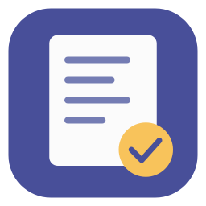
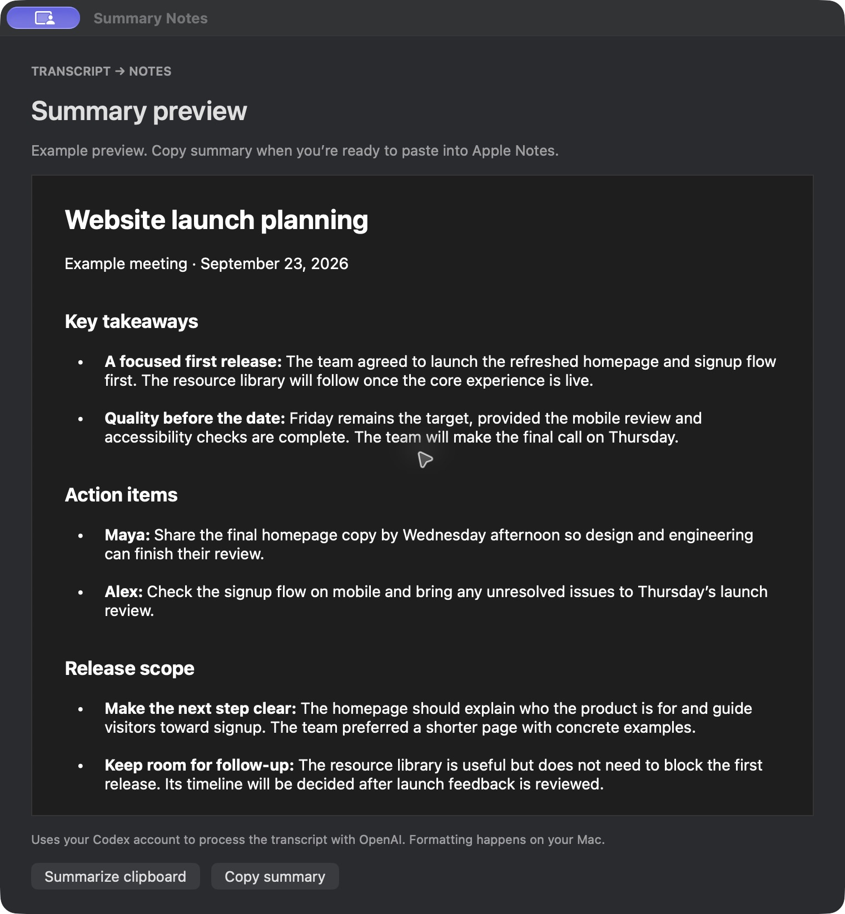

# Summary Notes

**Paste a transcript. Summarize it. Copy readable notes into Apple Notes.**

Summary Notes is a small native macOS app that turns a raw call transcript into a detailed, scannable summary and puts the result on your clipboard as rich text. It accepts plain text or Markdown copied from Nook, Granola, or another transcription app.

You choose where to paste. Summary Notes never creates or edits an Apple Note.

*A sample summary with takeaways, action items, and formatting ready for Apple Notes.*

## Download

**[Download Summary Notes 1.0 for Mac](https://github.com/niederme/summary-notes/releases/download/v1.0.0/Summary-Notes-1.0-universal.zip)**

Unzip the download and move **Summary Notes.app** to Applications. The app is Developer ID signed, notarized by Apple, and includes Apple silicon and Intel versions. You do not need Xcode.

**Version 1.0 requires Codex CLI, a signed-in Codex account, and internet access.** Install Codex using the [official setup instructions](https://developers.openai.com/codex/cli/), then run `codex login` in Terminal. Summary Notes uses that login and your account’s usage allowance. With a ChatGPT login, you do not need a separate API key in this app.

The app targets macOS 14 or later. Testing so far has been on Apple silicon with macOS 27; Intel hardware and older macOS versions still need verification. [Release notes and checksum](https://github.com/niederme/summary-notes/releases/tag/v1.0.0).

## How to use it

1. Copy a full transcript from Nook, Granola, or another app.
2. Open Summary Notes, paste the transcript, and choose **Summarize**.
3. When the summary is ready and copied, paste it into Apple Notes with **⌘V**.

Use normal Paste to keep the formatting. **Paste and Match Style** removes it.

You get key takeaways, action items, and detailed topic sections, with bold headings and spaced bullets. Open questions and unclear transcription details are called out when relevant. Review important details, since AI summaries can contain mistakes.

## Working with summaries

- **Copy summary** copies the formatted result again.
- **Clear** empties the window and leaves your clipboard alone. You can also select all (**⌘A**) and paste another transcript, then choose **Summarize**.
- If you copy something else while processing, the app preserves your newer clipboard. Your summary waits in the window until you choose **Copy summary**.
- **Cancel** stops processing. Your transcript remains available to edit or retry.
- **Restore clipboard**, when available, restores what was on the clipboard when you started, provided you have not copied something else since the summary was copied.

Leave the app open throughout the day if you like. It does not monitor your clipboard or start processing on launch, reopening, or paste. Processing begins only when you choose **Summarize**.

Closing the window lets processing continue. Quitting cancels it and discards the in-memory transcript, summary, and clipboard backup. The app does not save a transcript library.

## Privacy

Summarization sends your transcript to **OpenAI through Codex**. Formatting happens on your Mac. Summary Notes never creates or edits an Apple Note.

The app normally removes its temporary model output when processing finishes; an interrupted shutdown can leave a temporary file behind. Clipboard managers may retain copied content. [Read the data-handling details](docs/PRIVACY.md).

## Help

If Codex is missing or signed out, install it and run `codex login` in Terminal. If your account reaches a usage limit, wait for it to reset before retrying. Failed or cancelled requests leave your clipboard intact.

Transcripts must contain at least 100 characters and fit within a 400,000-byte limit. Larger transcripts are rejected rather than cut off. Processing times out after ten minutes.

[Report a problem](https://github.com/niederme/summary-notes/issues), including your macOS and Codex versions and a small fictional example. Please leave private transcripts and credentials out of reports.

## What’s next

Planned: Apple Intelligence as the default for eligible Macs without another service configured, Claude support, optional API connections, a preferred provider in Settings, and a provider picker for trying another result. These features are not in 1.0. See the [roadmap](ROADMAP.md) for scope and constraints.

## Build or contribute

See the [development guide](docs/DEVELOPMENT.md) for source installation, architecture, tests, and release builds.

## Author and license

Created by **John Niedermeyer**, with AI-assisted development.

Released under the [MIT License](LICENSE). You may use, modify, and redistribute the software, including commercially, as long as you retain the copyright and license notice in copies or substantial portions. MIT does not require visible in-app credit or publication of your modifications.

The license covers this project's code and documentation. It does not grant rights to third-party tools, services, or trademarks, or change their terms. This is an independent project, not affiliated with Apple, OpenAI, Nook, or Granola.
